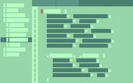

# Signal Tower Capture

## Local Collections Management

Signal Tower Capture is a desktop digital collections solution for managing 
files and folders on your local machine and referencing these to your
local on-site collection. It is ideally suited for smaller museums or
archives where you need a simple solution with zero-overheads and simplicity
of use.

This project was undertaken as a volunteer effort at the local
Signal Tower Museum in Arbroath, Scotland.
`
Originally built in 1813 as a base of operations for the famous Bell Rock Lighthouse, the Signal Tower housed the families of the keepers stationed on the 'rock', along with the vital shore staff who ran the lighthouse tender supplying the light. The name Signal Tower comes from the signalling apparatus installed atop of the tower building that was used to communicate between the shore staff (the Master Of The Tender) and the keepers of the lighthouse. `
[wikipedia](https://en.wikipedia.org/wiki/Signal_Tower_Museum)

### Technologies
Signal Tower Capture is built on the open-source Electron application framework 
and public domain SQLite database.

### Deployment (Windows)
Download the project and run the following npm command to create a distributable:

`npm run make`

https://www.electronjs.org/docs/latest/tutorial/tutorial-packaging

After the script runs, you should see an 'out' folder containing two sub-folders:

#### Distributable
  `out/make/squirrel.windows/x64/`

   The 'Signal Tower Capture-0.0.1 Setup.exe' file is ready to launch to install your application;
   the other two files are for auto-updating which is not supported for this app, so you can ignore.

#### Packaged Application Code
  `out/my-electron-app-name/`

The installation will deploy the application to the following windows folder:

`C:\Users\<username>\AppData\Local\signal_tower_capture\`

#### Installation Dialog
The install process is not a native standard Windows install process, the install dialog will look 
like this:

### Development
'npx electronmon .'

